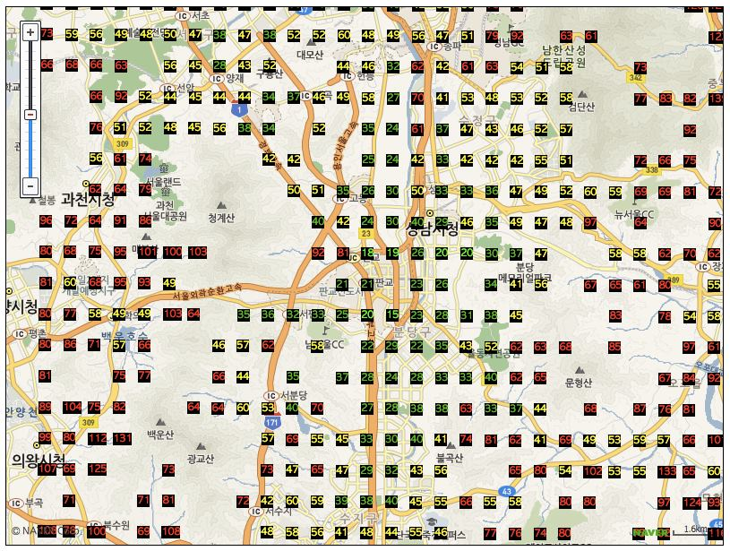
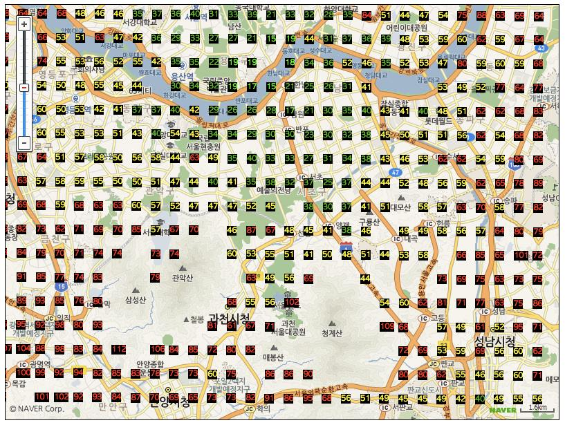
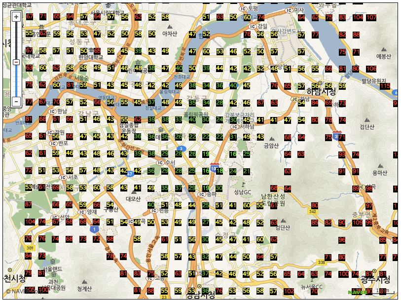

map1
====

교통 접근성 시각화 지도

## 개발 동기
어디로 이사 갈 지 고민 돼서 대중교통 접근성 시각화 Mash-up 개발.

부동산 가격도 연동하고 싶네요.

돈 많으면 고민 없이 그냥 판교 살면 되는데... 안타깝습니다.

## 개발
제안 사항 있으신 분은 https://github.com/keewon/map1/issues

Pull Request 받습니다.

## Note
이 웹앱은 NAVER 지도 API 를 사용합니다.
또한 길찾기 정보와 위치 검색을 위해 NAVER 지도의 비공식 API 도 사용합니다.
~문제가 될 경우 서비스를 내릴 수 있습니다.~

이 서비스는 문득 든 생각을 구현해보기 위해 만들었으나 현재 서비스 중이 아닙니다.
